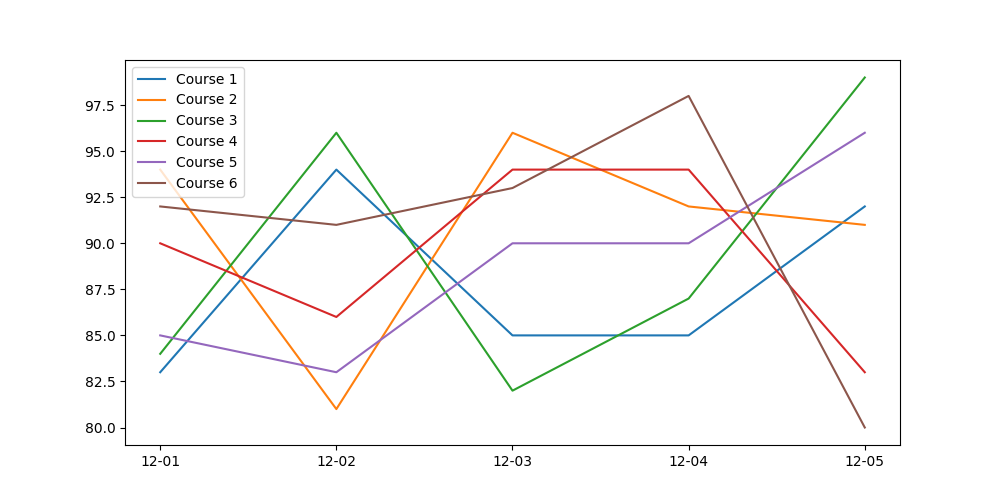

# AspenGrapher
An application to track grades posted on Follett Aspen over a period of time.  
* Scrapes the Aspen webpage periodically using a set of given login information to collect data. 
* A graph can be created from the collected data at any time and stored as a png image like the one below

# Install Dependencies
1. `git clone https://github.com/vishal-chandra/AspenGrapher`
2. `cd AspenGrapher`
3. `pip install -r requirements.txt`

# Install WebDriver
In order for selenium to be able to control Chrome programmatically, the ChromeDriver driver is required. It is available [here](https://chromedriver.storage.googleapis.com/index.html?path=2.44/).

Extract the contents of the .zip file and place them into `usr/local/bin` on mac/linux or add the path to the file to PATH on windows

# Define Credentials
In scraper.py, replace `os.getenv('ASPEN_USERNAME')` and `os.getenv('ASPEN_PASSWORD')` with your Aspen username and password, respectively. 

Alternatively, two bash/cmd environment variables named `ASPEN_USERNAME` and `ASPEN_PASSWORD` containing the account username and password, respectively,  can be set to avoid directly writing them into the code.
